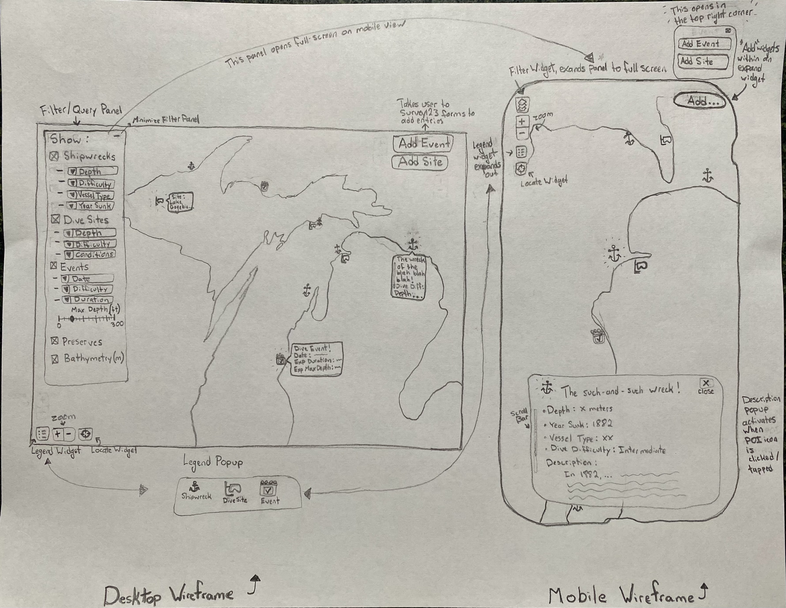
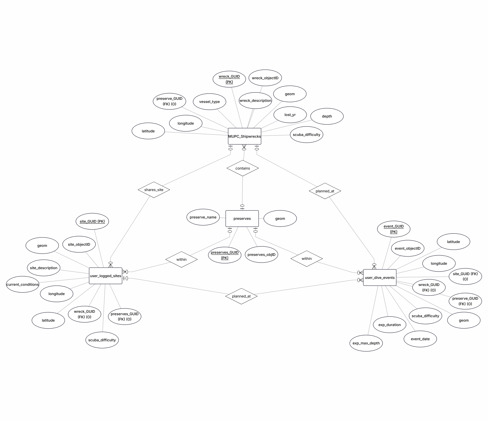

# GoDivePure App 
**GEOG 576: Midterm Project — Summer 2026** **Developer:** Hope McBride  

---

## Abstract

Boasting access to four of the Great Lakes, thirteen underwater preserves, hundreds of beautifully preserved historic shipwrecks, and countless inland lakes, Michigan offers some of the most unique freshwater diving opportunities in the United States. While local diving communities are highly active, helpful domain data remains scattered. Resources are distributed across multiple websites, organizations, and social channels, making trip planning and dive-site research time-consuming, particularly for new and visiting divers. Divers must routinely navigate multiple disparate platforms to research dive events, site difficulty, bathymetry measurements, shipwreck history, and current water conditions. This fragmented landscape creates a barrier to centralized spatial knowledge, making it challenging for local and visiting divers alike to adequately prepare for Michigan’s cold, dynamic waters.

The **GoDivePure** application fills this gap, offering a centralized geospatial hub designed to let users query, log, update, and crowdsource real-time diving information across the state. Tailored for the entire dive community—including recreational scuba divers, technical divers, dive clubs, and charter captains—GoDivePure features a responsive user interface optimized for both dive shop desktops and mobile devices of users already out in the dive boat.

The user interface features a **Nova Map** basemap overlaid with a high-resolution bathymetric tile layer, official underwater preserve boundaries, and shipwreck markers defined by the Michigan Department of Natural Resources. Advanced query tools inside a custom control panel allow users to filter marked dive spots by depth and dive difficulty. The application also features two intuitive, responsive survey forms for users
to add or edit entries on the map:
1. **"Log New Site"**: Allows divers to log new dive sites with explicit geographic coordinates and localized descriptions.
2. **"Add New Event"**: Lets users crowdsource planned group outings by inputting dates, exact locations, expected dive difficulty levels, and other relevant information.

These crowdsourced feature layers are hosted on ArcGIS Online and can be edited or toggled on or off within the interactive map framework.  

Inspired by the Pure Michigan campaign, GoDivePure aims to boost maritime tourism, improve diving safety through peer-to-peer condition reporting, and foster a close-knit diving community across the Great Lakes.

---

## Wireframe

---

## Data Inventory & Services Architecture

| Dataset Name | Layer Type | Description & Primary Attributes | Data Source / Owner | Access Endpoints |
| :--- | :--- | :--- | :--- | :--- |
| **Nova Map** | Vector Basemap | Dark slate and glowing neon canvas; optimized for high-contrast feature rendering. | Esri, Garmin, GIS User Community | [ArcGIS Online URL](https://www.arcgis.com/home/item.html?id=8d91bd39e873417ea21673e0fee87604#overview) |
| **Bathymetry of the Great Lakes** | Tile Layer | Depicts complex terrain bathymetry data in meters; rendered on client-side cache grids to optimize browser memory constraints. | Esri Canada Education & Research, NOAA | [REST URL](https://tiles.arcgis.com/tiles/As5CFN3ThbQpy8Ph/arcgis/rest/services/Bathymetry_of_the_Great_Lakes/MapServer) |
| **Great Lakes Underwater Preserves** | Feature Layer | Vector polygon boundaries representing Michigan's 13 official underwater sanctuaries. | Michigan Department of Natural Resources | [REST URL](https://services3.arcgis.com/Jdnp1TjADvSDxMAX/arcgis/rest/services/Great_Lakes_Underwater_Preserves/FeatureServer) |
| **MUPC Shipwreck Locations** | Feature Layer | Vector point locations of historical shipwreck sites. Attributes: `VesselType`, `LostYR`, `Depth`, `Preserve`, `ScubaDifficulty`. | Michigan DNR, Michigan Underwater Preserves Council, Inc. | [REST URL](https://services3.arcgis.com/Jdnp1TjADvSDxMAX/arcgis/rest/services/MUPC_Shipwreck_Locations_2020_view/FeatureServer) |
| **User Logged Sites** | Hosted Feature Layer | Custom read/write point layer logging crowdsourced dive site locations. Attributes: `ScubaDifficulty`, `CurrentConditions`, `SiteDescription`. | Crowdsourced (Hosted by hkmcbride@wisc.edu) | Managed via ArcGIS Online Developer Dashboard |
| **User Dive Events** | Hosted Feature Layer | Custom read/write point layer logging crowdsourced diving events. Attributes: `EventDate`, `ExpectedMaxDepth`, `ExpectedDuration`. | Crowdsourced (Hosted by hkmcbride@wisc.edu) | Managed via ArcGIS Online Developer Dashboard |

---

## Entity-Relationship (ER) Diagram

